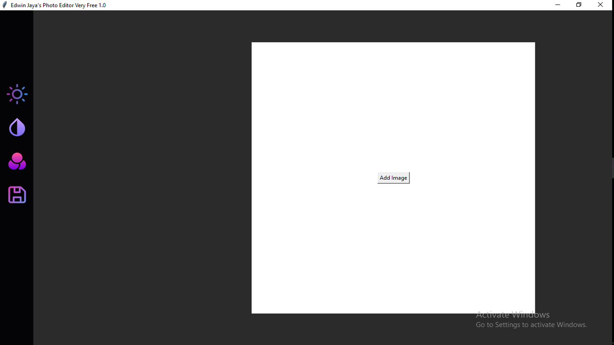
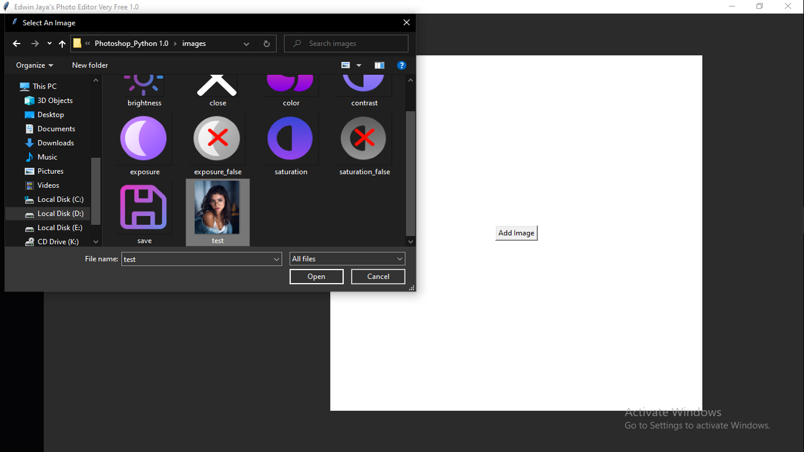
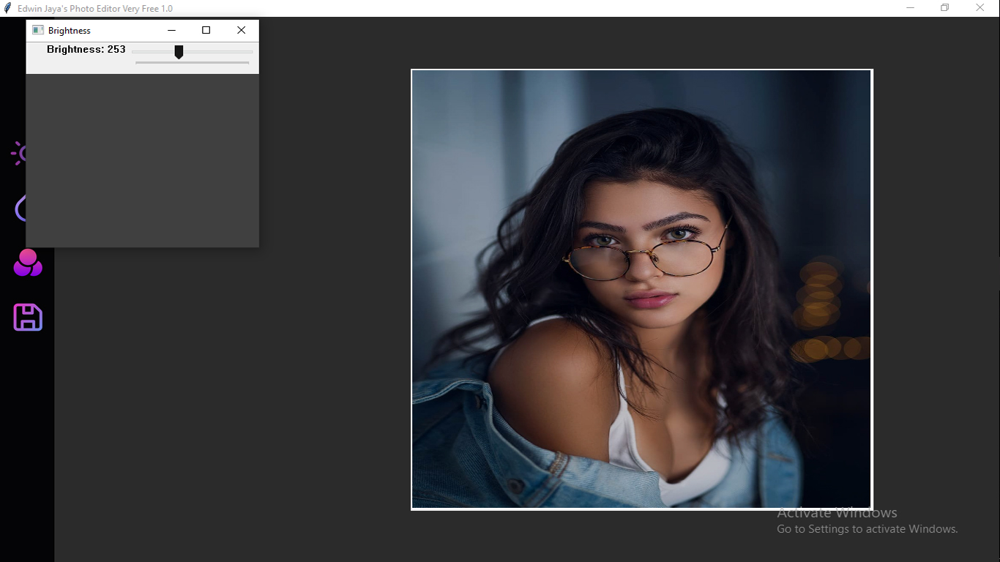
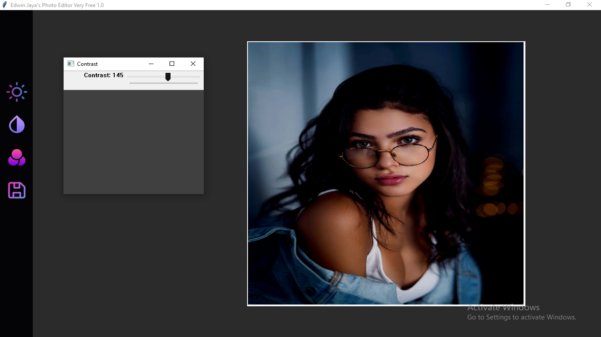
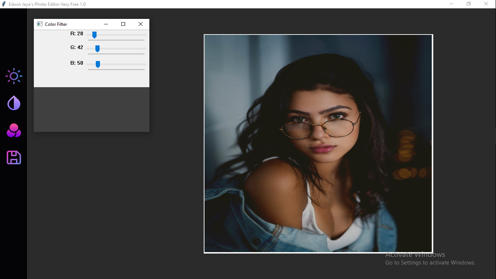

# Photoshop Python Version 1.0

## What it do?
   This application is able to help you adjust the brightness, contrast, and add an adjustable color filter to your picture. This program was made entirely with python to help me learning about image processing. Since i'm new to programming and especially image processing, there's a lot of challanges that i faced. Some of them was how to implement those features (brightness, contrast, color filter) to the photo and give an update everytimes the trackbar is change, and then there's a formula i found online that i used for the brightness. I've been trying to find out where it came from but no luck (Because the source says the formula came from another source, if you know please hmu :)).

## Features
[x]Adjust Brightness
[x]Adjust Contrast
[x]Add Color Filter
[x]Save the image

## Features to implement in the future
[]Adjusting shadow
[]Adjusting saturation
[]Make the result photo less blurry and more HD

## Language
Python

## Prerequiste
None

# How To Run
    python app.py

# Screenshots

## Main Menu

## Browse And Load An Image
There's a test image we could use in the image folder.

## Adjust the brightness

## Adjust the contrast

## Add a color filter

## Result

